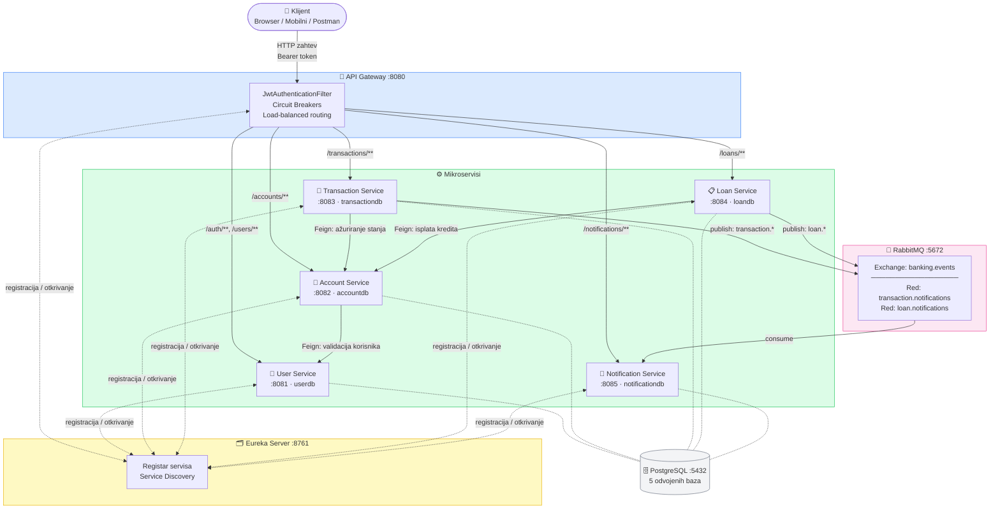
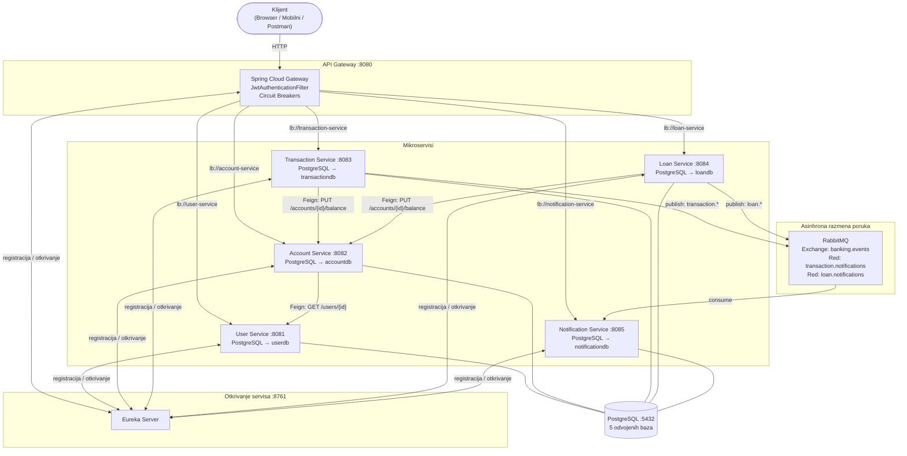

# Bankarski mikroservisni sistem

Produkcijski spreman bankarski sistem izgrađen na Spring Boot 3.2 i Spring Cloud 2023.0.1, koji implementira mikroservisnu arhitekturu sa JWT autentifikacijom, asinhronom razmenom poruka i potpuno automatizovanim CI/CD pipelineom.

---

## Pregled arhitekture



---

## Sadržaj

- [Poslovna logika](#poslovna-logika)
  - [User Service](#1-user-service-port-8081)
  - [Account Service](#2-account-service-port-8082)
  - [Transaction Service](#3-transaction-service-port-8083)
  - [Loan Service](#4-loan-service-port-8084)
  - [Notification Service](#5-notification-service-port-8085)
  - [API Gateway](#6-api-gateway-port-8080)
  - [Eureka Server](#7-eureka-server-port-8761)
- [Arhitektura sistema](#arhitektura-sistema)
- [Tehnološki stek](#tehnološki-stek)
- [API referenca](#api-referenca)
- [Pokretanje lokalno](#pokretanje-lokalno)
- [CI/CD pipeline](#cicd-pipeline)
- [Testni podaci](#testni-podaci)
- [Struktura projekta](#struktura-projekta)

---

## Poslovna logika

Sistem modeluje digitalnu bankarsku platformu. Svaka poslovna oblast je enkapsulirana u sopstveni nezavisno deployabilni mikroservis sa sopstvenom PostgreSQL bazom podataka (Database-per-Service obrazac).

### 1. User Service (port 8081)

Upravlja kompletnim životnim ciklusom korisnika i predstavlja autoritet za autentifikaciju u celom sistemu.

**Odgovornosti:**
- **Registracija** (`POST /auth/register`) — kreira novog korisnika, BCrypt enkoduje lozinku i odmah vraća potpisani JWT token.
- **Prijava** (`POST /auth/login`) — validira kredencijale, proverava da je nalog `ACTIVE` i izdaje JWT token sa rokom važenja od 24 sata.
- **CRUD korisnika** — dohvatanje korisnika po ID-u ili korisničkom imenu, ažuriranje podataka profila i brisanje naloga.

**Statusi korisnika:** `ACTIVE` | `INACTIVE` | `SUSPENDED`

**JWT:** Tokeni se potpisuju algoritmom HMAC-SHA256 sa zajedničkim tajnim ključem. Gateway validira svaki zaštićeni zahtev i prosleđuje `X-User-Id` header u downstream servise.

---

### 2. Account Service (port 8082)

Upravlja bankovnim računima. Pre kreiranja računa, sinhrono proverava da korisnik postoji pozivanjem **user-service** putem OpenFeign klijenta sa Resilience4j Circuit Breakerom za otpornost na greške.

**Odgovornosti:**
- Kreiranje tekućih, štednih ili poslovnih računa vezanih za korisnika.
- Dohvatanje računa po ID-u, broju računa ili ID-u korisnika.
- Ažuriranje stanja (CREDIT ili DEBIT operacije) — DEBIT se odbija ako nema dovoljno sredstava (`422 Unprocessable Entity`).
- Zatvaranje računa (soft-delete: postavlja status na `CLOSED`).

**Tipovi računa:** `CHECKING` | `SAVINGS` | `BUSINESS`  
**Statusi računa:** `ACTIVE` | `INACTIVE` | `FROZEN` | `CLOSED`

---

### 3. Transaction Service (port 8083)

Obrađuje sve novčane transakcije. Komunicira sa **account-service** putem OpenFeign klijenta radi ažuriranja stanja. Nakon svake uspešne operacije, objavljuje događaj na RabbitMQ kako bi notification-service mogao asinhrono da reaguje.

**Odgovornosti:**
- **Uplata** (`POST /transactions/deposit`) — odobrava iznos na jedan račun.
- **Isplata** (`POST /transactions/withdraw`) — tereti jedan račun; vraća `422` u slučaju nedovoljnih sredstava.
- **Prenos** (`POST /transactions/transfer`) — atomski tereti izvorni račun i odobrava odredišni račun.
- Pregled transakcija po ID-u ili po računu (vraća sve transakcije u kojima je dati račun izvor ili odredište).

**RabbitMQ:** objavljuje na exchange `banking.events` sa routing ključem `transaction.*`, koje konzumira red `transaction.notifications`.

**Tipovi transakcija:** `DEPOSIT` | `WITHDRAWAL` | `TRANSFER`  
**Statusi transakcija:** `PENDING` | `COMPLETED` | `FAILED` | `CANCELLED`

---

### 4. Loan Service (port 8084)

Upravlja kompletnim kreditnim ciklusom od zahteva do konačne otplate. Poziva **account-service** radi isplate sredstava pri odobravanju. Objavljuje događaje na RabbitMQ nakon svake promene stanja kredita.

**Odgovornosti:**
- **Zahtev za kredit** (`POST /loans`) — kreira zahtev u statusu `PENDING`. Mesečna rata se automatski izračunava po standardnoj anuitetnoj formuli.
- **Odobravanje kredita** (`PUT /loans/{id}/approve`) — prelazi u status `ACTIVE`, isplaćuje iznos kredita na vezani račun putem account-service.
- **Odbijanje kredita** (`PUT /loans/{id}/reject`) — prelazi u status `REJECTED`.
- **Uplata rate** (`POST /loans/{id}/payment`) — evidentira uplatu raspodeljenu na deo glavnice i kamate, smanjuje `remainingAmount`. Automatski prelazi u `PAID_OFF` kada `remainingAmount` dostigne nulu.
- Pregled kredita po ID-u ili po korisniku.

**Tipovi kredita:** `PERSONAL` | `MORTGAGE` | `AUTO` | `BUSINESS` | `STUDENT`  
**Statusi kredita:** `PENDING` | `APPROVED` | `ACTIVE` | `REJECTED` | `PAID_OFF` | `DEFAULTED`  
**Statusi rata:** `PENDING` | `PAID` | `OVERDUE` | `WAIVED`

---

### 5. Notification Service (port 8085)

Servis vođen događajima. Ne izlaže nikakve endpoint-e za pisanje — isključivo persituje notifikacije kreirane od strane uzvodnih servisa.

**Odgovornosti:**
- Osluškuje red `transaction.notifications` — kreira `TRANSACTION` notifikaciju za svaki događaj uplate, isplate ili prenosa.
- Osluškuje red `loan.notifications` — kreira `LOAN` notifikaciju za svaku promenu stanja kredita.
- Pregled notifikacija po ID-u ili po korisniku.

**Tipovi notifikacija:** `TRANSACTION` | `LOAN` | `ACCOUNT`  
**Kanali notifikacija:** `EMAIL` | `SMS` | `PUSH`  
**Statusi notifikacija:** `PENDING` | `SENT` | `FAILED`

---

### 6. API Gateway (port 8080)

Jedinstvena ulazna tačka za sve klijente. Izgrađen na Spring Cloud Gateway (reaktivni WebFlux).

**Odgovornosti:**
- **JWT validacija** — svaki zahtev (osim `/auth/**`) prolazi kroz `JwtAuthenticationFilter`. Nevalidni ili nedostajući tokeni dobijaju `401 Unauthorized`. Pri uspešnoj validaciji, filter dodaje `X-User-Id` header u zahtev ka downstream servisu.
- **Load-balansirano rutiranje** — usmerava zahteve ka instancama servisa registrovanim u Eureki koristeći `lb://` shemu.
- **Circuit Breaker** — svaka ruta ima poseban Resilience4j circuit breaker (prozor od 10 poziva, prag greške 50%, otvoreno stanje 10 s). Otvoreni circuit breaker prosleđuje zahtev na `/fallback/{naziv-servisa}`.

| Prefiks putanje | Downstream servis |
|---|---|
| `/auth/**` | user-service |
| `/users/**` | user-service |
| `/accounts/**` | account-service |
| `/transactions/**` | transaction-service |
| `/loans/**` | loan-service |
| `/notifications/**` | notification-service |

---

### 7. Eureka Server (port 8761)

Netflix Eureka registar servisa. Svi mikroservisi i API Gateway se registruju pri pokretanju i koriste Eureku za client-side load balancing. Sam server se ne registruje kao klijent.

---

## Arhitektura sistema



### Obrasci komunikacije

| Tip | Između servisa | Tehnologija |
|---|---|---|
| Sinhroni REST | account-service → user-service | OpenFeign + Resilience4j CB |
| Sinhroni REST | transaction-service → account-service | OpenFeign + Resilience4j CB |
| Sinhroni REST | loan-service → account-service | OpenFeign + Resilience4j CB |
| Asinhroni događaji | transaction-service → notification-service | RabbitMQ Topic Exchange |
| Asinhroni događaji | loan-service → notification-service | RabbitMQ Topic Exchange |

---

## Tehnološki stek

| Kategorija | Tehnologija |
|---|---|
| Programski jezik | Java 17 |
| Framework | Spring Boot 3.2.0 |
| Otkrivanje servisa | Spring Cloud Netflix Eureka 2023.0.1 |
| API Gateway | Spring Cloud Gateway (WebFlux) |
| HTTP između servisa | OpenFeign |
| Otpornost na greške | Resilience4j (Circuit Breaker) |
| Broker poruka | RabbitMQ 3.12 |
| Baza podataka | PostgreSQL 15 |
| ORM | Spring Data JPA / Hibernate |
| Bezbednost | Spring Security 6 + JWT (JJWT) |
| API dokumentacija | SpringDoc OpenAPI 3 (Swagger UI) |
| Testiranje | JUnit 5, Mockito, Testcontainers |
| Pokrivenost koda | JaCoCo |
| Alat za build | Maven (multi-modul) |
| Kontejnerizacija | Docker, Docker Compose |
| CI/CD | GitHub Actions |

---

## API referenca

Svi endpoint-i (osim `/auth/**`) zahtevaju `Bearer` token u `Authorization` headeru.

Interaktivni Swagger UI je dostupan po servisu pri lokalnom pokretanju:

| Servis | Swagger UI |
|---|---|
| user-service | http://localhost:8081/swagger-ui.html |
| account-service | http://localhost:8082/swagger-ui.html |
| transaction-service | http://localhost:8083/swagger-ui.html |
| loan-service | http://localhost:8084/swagger-ui.html |
| notification-service | http://localhost:8085/swagger-ui.html |

### Autentifikacija

| Metoda | Putanja | Autorizacija | Opis |
|---|---|---|---|
| `POST` | `/auth/register` | Javno | Registracija i dobijanje JWT tokena |
| `POST` | `/auth/login` | Javno | Prijava i dobijanje JWT tokena |

**Telo zahteva za registraciju:**
```json
{
  "username": "johndoe",
  "password": "password123",
  "email": "john@example.com",
  "firstName": "John",
  "lastName": "Doe"
}
```

**Odgovor:**
```json
{
  "token": "eyJhbGciOiJIUzI1NiJ9...",
  "userId": 1,
  "username": "johndoe",
  "expiresAt": "2026-06-06T09:00:00"
}
```

### Korisnici

| Metoda | Putanja | Opis |
|---|---|---|
| `GET` | `/users/{id}` | Dohvati korisnika po ID-u |
| `GET` | `/users/username/{username}` | Dohvati korisnika po korisničkom imenu |
| `GET` | `/users` | Lista svih korisnika |
| `PUT` | `/users/{id}` | Ažuriraj korisnika |
| `DELETE` | `/users/{id}` | Obriši korisnika |

### Računi

| Metoda | Putanja | Opis |
|---|---|---|
| `POST` | `/accounts` | Kreiraj račun |
| `GET` | `/accounts/{id}` | Dohvati račun po ID-u |
| `GET` | `/accounts/number/{accountNumber}` | Dohvati po broju računa |
| `GET` | `/accounts/user/{userId}` | Svi računi korisnika |
| `PUT` | `/accounts/{id}/balance` | Ažuriraj stanje (CREDIT/DEBIT) |
| `DELETE` | `/accounts/{id}` | Zatvori račun |

### Transakcije

| Metoda | Putanja | Opis |
|---|---|---|
| `POST` | `/transactions/deposit` | Uplata sredstava |
| `POST` | `/transactions/withdraw` | Isplata sredstava |
| `POST` | `/transactions/transfer` | Prenos između računa |
| `GET` | `/transactions/{id}` | Dohvati transakciju po ID-u |
| `GET` | `/transactions/account/{accountId}` | Sve transakcije za račun |

### Krediti

| Metoda | Putanja | Opis |
|---|---|---|
| `POST` | `/loans` | Podnesi zahtev za kredit |
| `PUT` | `/loans/{id}/approve` | Odobri kredit (isplaćuje sredstva) |
| `PUT` | `/loans/{id}/reject` | Odbij zahtev za kredit |
| `POST` | `/loans/{id}/payment` | Uplata kreditne rate |
| `GET` | `/loans/{id}` | Dohvati kredit po ID-u |
| `GET` | `/loans/user/{userId}` | Svi krediti korisnika |

### Notifikacije

| Metoda | Putanja | Opis |
|---|---|---|
| `GET` | `/notifications/{id}` | Dohvati notifikaciju po ID-u |
| `GET` | `/notifications/user/{userId}` | Sve notifikacije korisnika |

---

## Pokretanje lokalno

### Preduslovi

- Docker Desktop 4.x+
- Java 17 (za pokretanje servisa van Dockera)
- Maven 3.9+

### Pokretanje putem Docker Compose

```bash
# Kloniraj repozitorijum
git clone https://github.com/<korisnicko-ime>/<naziv-repo>.git
cd <naziv-repo>

# Izgradi i pokreni sve servise (prvo pokretanje traje ~5 minuta)
docker compose up --build -d

# Proveri da su svi servisi zdravi
docker compose ps
```

**Redosled pokretanja:** PostgreSQL i RabbitMQ → Eureka Server → Mikroservisi → API Gateway

Sačekaj oko 60–90 sekundi da Eureka registracija bude kompletna pre slanja zahteva.

### URL-ovi servisa

| Servis | URL |
|---|---|
| API Gateway | http://localhost:8080 |
| Eureka Dashboard | http://localhost:8761 |
| RabbitMQ Management | http://localhost:15672 (guest/guest) |
| user-service Swagger | http://localhost:8081/swagger-ui.html |
| account-service Swagger | http://localhost:8082/swagger-ui.html |
| transaction-service Swagger | http://localhost:8083/swagger-ui.html |
| loan-service Swagger | http://localhost:8084/swagger-ui.html |
| notification-service Swagger | http://localhost:8085/swagger-ui.html |

### Brzi početak — kompletan tok

```bash
# 1. Registracija korisnika (dobijanje JWT tokena)
curl -s -X POST http://localhost:8080/auth/register \
  -H "Content-Type: application/json" \
  -d '{"username":"testuser","password":"password123","email":"test@example.com","firstName":"Test","lastName":"User"}'

# 2. Sačuvaj token
TOKEN="eyJhbGciOiJIUzI1NiJ9..."

# 3. Kreiraj tekući račun za korisnika ID 1
curl -s -X POST http://localhost:8080/accounts \
  -H "Authorization: Bearer $TOKEN" \
  -H "Content-Type: application/json" \
  -d '{"userId":1,"type":"CHECKING","currency":"RSD"}'

# 4. Uplati sredstva na račun ID 1
curl -s -X POST http://localhost:8080/transactions/deposit \
  -H "Authorization: Bearer $TOKEN" \
  -H "Content-Type: application/json" \
  -d '{"accountId":1,"amount":100000.00,"description":"Inicijalna uplata"}'

# 5. Podnesi zahtev za lični kredit
curl -s -X POST http://localhost:8080/loans \
  -H "Authorization: Bearer $TOKEN" \
  -H "Content-Type: application/json" \
  -d '{"userId":1,"accountId":1,"amount":300000,"interestRate":8.5,"termMonths":36,"type":"PERSONAL","purpose":"Renovacija stana"}'

# 6. Proveri notifikacije
curl -s http://localhost:8080/notifications/user/1 \
  -H "Authorization: Bearer $TOKEN"
```

### Učitavanje testnih podataka

Nakon što su servisi pokrenuti i kreirali tabele u bazi:

```bash
psql -U postgres -h localhost -f docker/seed-data.sql
```

### Zaustavljanje i čišćenje

```bash
# Zaustavi servise (čuva podatke u volumenima)
docker compose down

# Zaustavi i ukloni sve podatke
docker compose down -v
```

### Pokretanje pojedinačnog servisa lokalno (bez Dockera)

Zahteva da PostgreSQL i RabbitMQ rade lokalno, i da Eureka Server bude pokrenut prvi.

```bash
# Pokreni Eureka Server
cd eureka-server
mvn spring-boot:run

# Pokreni servis (primer: user-service)
cd user-service
mvn spring-boot:run
```

---

## CI/CD Pipeline

Pipeline se sastoji od tri sekvencijalna, potpuno automatizovana GitHub Actions workflow-a koji se okidaju isključivo na `main` grani.

```
push na main granu
        │
        ▼
┌─────────────────────────────────────────┐
│  Workflow 1: Build and Test              │
│                                         │
│  kompilacija (svi moduli)               │
│         │                               │
│         ▼                               │
│  unit testovi (7 servisa, paralelno)    │
│  + JaCoCo pokrivenost (3 servisa)       │
│         │                               │
│         ▼                               │
│  integracioni testovi (5 servisa,       │
│  paralelno, Testcontainers)             │
└──────────────┬──────────────────────────┘
               │ pri uspehu
               ▼
┌─────────────────────────────────────────┐
│  Workflow 2: Docker Publish              │
│                                         │
│  Izgradnja i guranje 7 Docker slika     │
│  na Docker Hub (paralelno)              │
│  Tagovi: :latest + :<commit-sha>        │
└──────────────┬──────────────────────────┘
               │ pri uspehu
               ▼
┌─────────────────────────────────────────┐
│  Workflow 3: Deploy                      │
│                                         │
│  deploy-dev  ──── automatski            │
│         │                               │
│         ▼ (manuelno odobrenje)          │
│  deploy-staging                         │
│         │                               │
│         ▼ (manuelno odobrenje)          │
│  deploy-production                      │
│  + git tag v{run_number}               │
└─────────────────────────────────────────┘
```

### Workflow 1 — Build and Test

**Fajl:** `.github/workflows/build-and-test.yml`  
**Okidač:** push ili pull request na `main` granu

| Faza | Detalji |
|---|---|
| **Kompilacija** | `mvn clean compile -DskipTests` za sve module |
| **Unit testovi** | 7 paralelnih poslova (po jedan za svaki servis), uploaduje Surefire izveštaje kao artefakte |
| **Pokrivenost** | JaCoCo HTML izveštaj za `user-service`, `account-service`, `transaction-service` |
| **Integracioni testovi** | 5 paralelnih poslova koji koriste Testcontainers (pokreću pravi PostgreSQL i RabbitMQ u Dockeru) |

Artefakti se čuvaju 7 dana:
- `unit-test-results-{servis}` — Surefire XML izveštaji
- `coverage-{servis}` — JaCoCo HTML izveštaji
- `integration-test-results-{servis}` — Failsafe XML izveštaji

### Workflow 2 — Docker Publish

**Fajl:** `.github/workflows/docker-publish.yml`  
**Okidač:** workflow `Build and Test` se uspešno završi na `main` grani

Gradi i gura 7 Docker slika paralelno na Docker Hub koristeći višefazne buildove (Maven build + minimalna JRE runtime slika).

Svaka slika dobija dva taga:
```
<DOCKERHUB_USERNAME>/banking-<servis>:latest
<DOCKERHUB_USERNAME>/banking-<servis>:<commit-sha>
```

**Potrebni GitHub Secrets:**

| Secret | Opis |
|---|---|
| `DOCKERHUB_USERNAME` | Korisničko ime Docker Hub naloga |
| `DOCKERHUB_TOKEN` | Docker Hub pristupni token (ne lozinka) |

Keširanjem slojeva putem GitHub Actions cache-a (`type=gha`) po servisu ubrzava se svaki naredni build.

**Postavljanje secrets-a:**

```bash
# Putem GitHub CLI
gh secret set DOCKERHUB_USERNAME --body "tvoje-dockerhub-korisnicko-ime"
gh secret set DOCKERHUB_TOKEN    --body "tvoj-dockerhub-token"
```

Ili putem **Settings → Secrets and variables → Actions → New repository secret**.

### Workflow 3 — Deploy

**Fajl:** `.github/workflows/deploy.yml`  
**Okidač:** workflow `Docker Publish` se uspešno završi na `main` grani

Tri sekvencijalne faze deployovanja sa postepeno strožom kontrolom pristupa:

| Faza | Okruženje | Odobrenje | URL |
|---|---|---|---|
| `deploy-dev` | `development` | Automatski | http://dev.banking.local |
| `deploy-staging` | `staging` | Manuelno (obavezni reviewer) | http://staging.banking.local |
| `deploy-production` | `production` | Manuelno (obavezni reviewer) | http://banking.local |

Nakon uspešnog deployovanja na produkciju, automatski se kreira i gura git tag `v{run_number}` radi označavanja release-a.

**Podešavanje manuelnih odobrenja:**

1. Idi na **Settings → Environments** u GitHub repozitorijumu.
2. Kreiraj okruženja pod nazivima `staging` i `production`.
3. Pod svakim okruženjem, aktiviraj **Required reviewers** i dodaj odgovarajuće članove tima.

### Ručno pokretanje workflow-ova

```bash
# Pokreni Build and Test workflow ručno
gh workflow run build-and-test.yml --ref main

# Proveri status workflow-a
gh run list --workflow=build-and-test.yml
```

---

## Testni podaci

Unapred pripremljeni SQL testni podaci nalaze se u `docker/seed-data.sql`.

```bash
# Učitaj nakon `docker compose up` (tabele moraju već postojati)
psql -U postgres -h localhost -f docker/seed-data.sql
```

| Baza | Tabela | Zapisi |
|---|---|---|
| `userdb` | `users` | 5 korisnika |
| `accountdb` | `accounts` | 9 računa (CHECKING, SAVINGS, BUSINESS) |
| `transactiondb` | `transactions` | 20 transakcija (uplate, isplate, prenosi — jedna FAILED) |
| `loandb` | `loans` | 7 kredita (ACTIVE, PENDING, PAID_OFF, REJECTED) |
| `loandb` | `loan_payments` | 50+ zapisa otplatnih rata |
| `notificationdb` | `notifications` | 21 notifikacija |

Korisnici za prijavu (lozinka za sve: `password123`):

| Korisničko ime | Status | Računi |
|---|---|---|
| `johndoe` | ACTIVE | CHECKING + SAVINGS |
| `janesmith` | ACTIVE | CHECKING + SAVINGS |
| `markjohnson` | ACTIVE | BUSINESS + CHECKING |
| `peraperovic` | ACTIVE | CHECKING + SAVINGS |
| `anamilic` | SUSPENDED | CHECKING (FROZEN) |

---

## Struktura projekta

```
.
├── api-gateway/                    # Spring Cloud Gateway (WebFlux)
├── eureka-server/                  # Netflix Eureka registar servisa
├── user-service/                   # Autentifikacija i upravljanje korisnicima
├── account-service/                # Upravljanje bankovnim računima
├── transaction-service/            # Uplata / isplata / prenos
├── loan-service/                   # Kreditni životni ciklus i rate
├── notification-service/           # Konzumer notifikacija vođen događajima
├── docker/
│   ├── init-db.sql                 # Kreira 5 PostgreSQL baza
│   └── seed-data.sql               # Demo podaci za sve servise
├── docker-compose.yml
├── pom.xml                         # Root multi-modul POM
└── .github/
    └── workflows/
        ├── build-and-test.yml
        ├── docker-publish.yml
        └── deploy.yml
```

---

## Autor

Filip Ilić — DIS I7/9 2024
